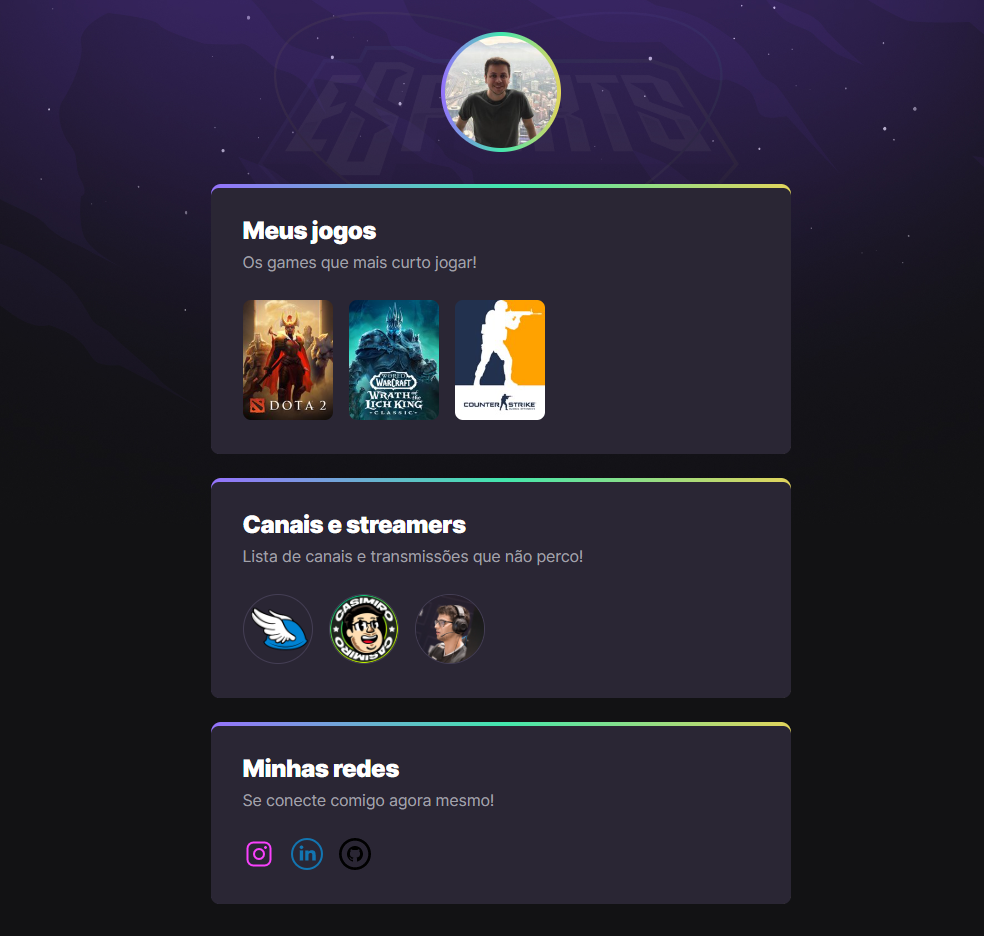

# NLW eSports

> Trilha Explorer

Projeto construído durante evento Next Level Week da Rocketseat.

[🔗 Clique aqui para acessar](https://leosignori.github.io/NLW-eSports/)

## 🛠 Tecnologias

- HTLM
- CSS
- Git e Github

## 📚 O que aprendi

- Estruturação de texto, sintaxe, criação de links e imagem.
- Box model, especificidade, declarações e animações.
- Criação de repositório no Github e versionamento de código.

## ✉ Contato

signorileo@gmail.com